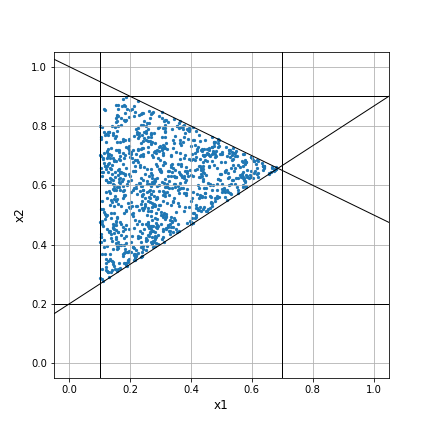

# diversipy
[](https://travis-ci.org/DavidWalz/diversipy)
[](https://diversipy.readthedocs.io/en/latest/?badge=latest)
[](https://codeclimate.com/github/DavidWalz/diversipy/maintainability)

*This is a fork/rewrite of [diversipy](https://pypi.org/project/diversipy/).*

diversipy is a collection of algorithms dealing with the following related topics.

1. Super-uniform sampling from the unit hypercube: ‘Super-uniform’ in this context means that the obtained point sample should be more uniform than a random uniform sample, which is a desirable property in many applications.
2. Uniform sampling from convex polytopes: This corresponds to sampling in the presence of linear inequality and equality constraints.
3. Subset selection: Suppose you have a set of points in and want to select a sample of them distributed as uniformly as possible. The selection problem is related to clustering, with the difference that when using clustering, you usually want to retain the structure of the original point set.
4. Diversity indicators: Once one has created (or obtained from somewhere) a point set, one may want to assess its properties. Therefore, diversipy contains several functions to measure diversity and a few related concepts.

#### Installation
```
pip install git+https://github.com/DavidWalz/diversipy.git
```

#### Example
Latin hypercube and diverse subset selection:
```python
from diversipy import cube, subset, indicator
X = cube.latin_design(50, 2)) # create latin hypercube design
X = cube.transform_spread_out(X)
subset = subset.psa_select(X, 10) # select subset, for whatever reason
indicator.unanchored_L2_discrepancy(subset) # calculate discrepancy
```

Sample a number of points (x1, x2) subject to some inequality constraints:
```python
from diversipy import polytope
X = polytope.sample(
    n_points=1000,
    lower=[-0.1, -0.2],
    upper=[0.7, 0.9],
    A1=np.array([[1 / 2, 1], [2 / 3, -1]]),
    b1=np.array([1, -0.2])
)
```

